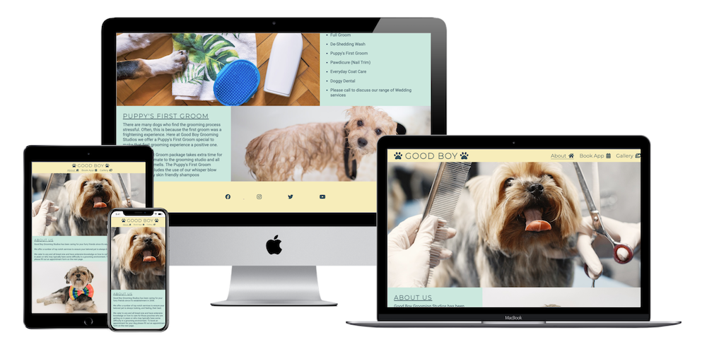
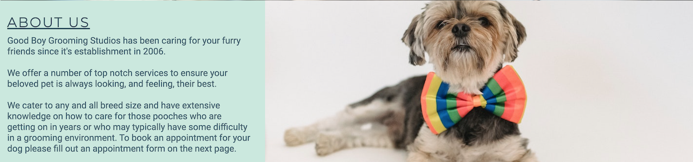
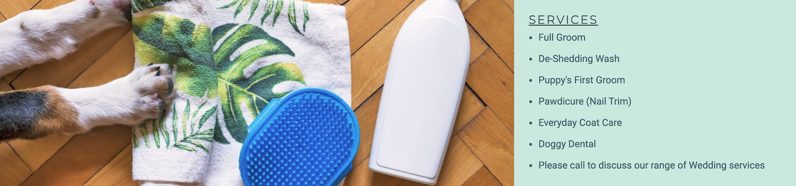
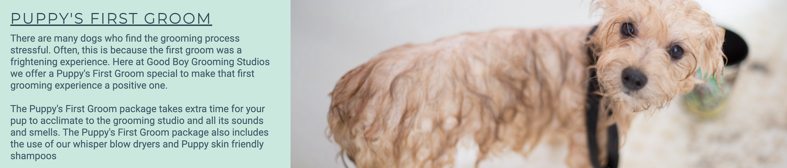
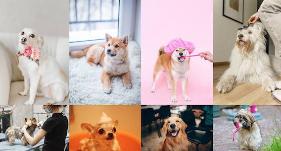
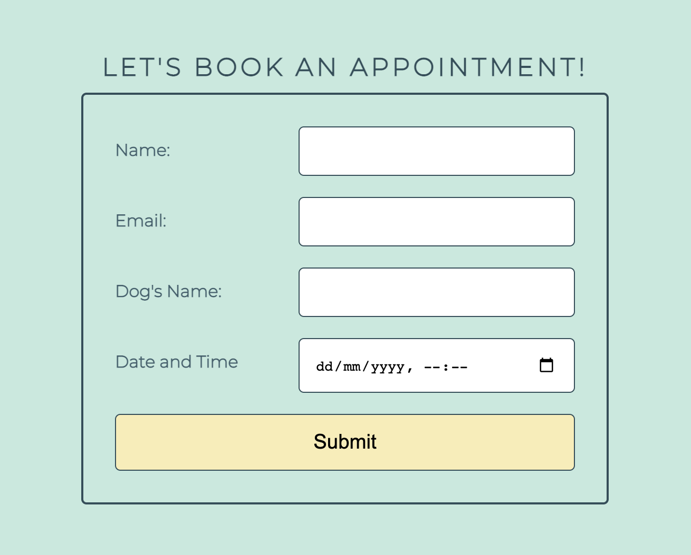

# Good Boy Grooming Studios
---
Good Boy Grooming Studios is a website for dog owners in the Kilkenny. It offers people bathing and grooming services for their dogs. It provides a method of ensuring pet cleanliness to those who may/ may not otherwise not have the capabilities or facilities to ensure so at home. 

The website can be accessed [here](https://harjayne.github.io/good-boy-grooming/)

# Existing Features
---
## Landing Page
The landing page consists of a Nav bar, and three sections each giving the user information regarding the business' background in the industry (section one), examples of services on offer (section 2) and details regarding a Puppy's first groom (section three). The hero image on the landing page has a small animation on it to draw attention on opening the page.

## Nav bar
The Nav Bar allows user navigation throughut the site without the need to use the forward and back buttons. With first time user goals in mind, through the use of Nav and unordered list html elements the user can navigate the About, Book App and Gallery pages.

## Section One - About Us - 

The About Us section offers a quick introduction into who the Good Boy Grooming Studios are and where the groomers' areas of expertise are.

## Section Two - Services -
The Services section offers a non-exhaustive example of the types of services users can avail of.

## Section Three - Puppy's First Groom - 
 A section detailing some of the main differences between a Puppy's First Groom service and a traditional groom service.

## Footer
The footer displays social media icons that, when clicked, open in a new tab.

## Gallery
The gallery page (gallery.html) shows images of past clients and in action photo's of some of the grooming services. Resposnive design was used so images are clear on a number fo screen sizes.

## Form
A form is used in order to book a grooming appointment. The form cannot be submitted without the required fields being filled. 

## Form Dump
A form dump page is displayed when all required fields have been filled to notify the user that the form has successfully been submitted.

# Features to Implement
- Add additional inputs to form to allow selection of breed size and hair   type.
- Add secure user log in for payment profile
- Add  commerce capabilities
- Add another page regarding possible kennel boarding services.
---

# Testing
--- 

# Deployment
---

# Credits
---

