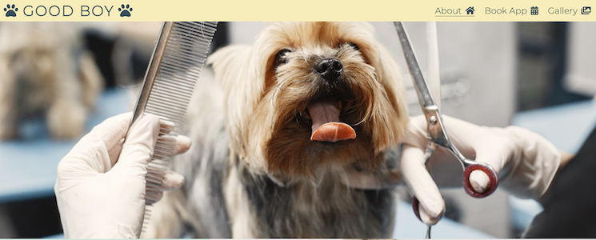
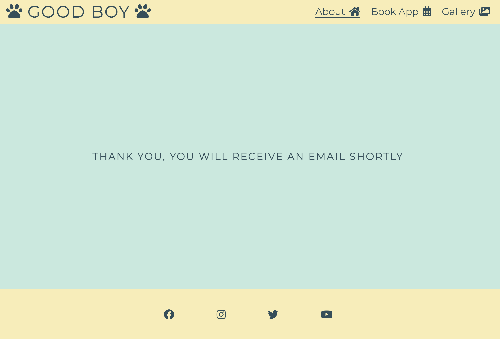

# Good Boy Grooming Studios
---
Good Boy Grooming Studios is a website for dog owners in the Kilkenny. It offers people bathing and grooming services for their dogs. It provides a method of ensuring pet cleanliness to those who may/ may not otherwise not have the capabilities or facilities to ensure so at home. 

The website can be accessed [here](https://harjayne.github.io/good-boy-grooming/)

# Existing Features
---
## Landing Page
The landing page consists of a Nav bar, and three sections each giving the user information regarding the business' background in the industry (section one), examples of services on offer (section 2) and details regarding a Puppy's first groom (section three). The hero image on the landing page has a small animation on it to draw attention on opening the page.

## Nav bar
The Nav Bar allows user navigation throughut the site without the need to use the forward and back buttons. With first time user goals in mind, through the use of Nav and unordered list html elements the user can navigate the About, Book App and Gallery pages.

## Section One - About Us - 

The About Us section offers a quick introduction into who the Good Boy Grooming Studios are and where the groomers' areas of expertise are.

## Section Two - Services -
The Services section offers a non-exhaustive example of the types of services users can avail of.

## Section Three - Puppy's First Groom - 
 A section detailing some of the main differences between a Puppy's First Groom service and a traditional groom service.

## Footer
The footer displays social media icons that, when clicked, open in a new tab.

## Gallery
The gallery page (gallery.html) shows images of past clients and in action photo's of some of the grooming services. Resposnive design was used so images are clear on a number fo screen sizes.

## Form
A form is used in order to book a grooming appointment. The form cannot be submitted without the required fields being filled. 

## Form Dump
A form dump page is displayed when all required fields have been filled to notify the user that the form has successfully been submitted.

# Features to Implement
- Add additional inputs to form to allow selection of breed size and hair   type.
- Add secure user log in for payment profile
- Add  commerce capabilities
- Add another page regarding possible kennel boarding services.
---

# Testing
--- 
## Responsiveness
Test responsiveness of website across different screen sizes and browser (Chrome, Safari, Safari IOS). Using dev tools some issues with sizing, padding and margin were brought to my attention and recitified.

## Navigation links
Links within navigation bar individually tested by clicking each link (About, Book App, Gallery) and ensuring it directs to the correct corresponding page. Active link underlined on active page of website. 

## Social media links
Social media links in footer tested individually and open to corresponding website in new broswer tab.

## Form
Form tested leaving different required input fields blank for each test. Form does not submit without required fields filled correctly.

## Validator Testing
To test HTML I used [HTML-W3C HTML Validator](https://validator.w3.org/)

On initial validation some errors regarding duplicate tags were highlighted, along with warnings regarding sections. Duplicate tags were then removed and relevant sections changed to main. After these small changes the HTML for all pages then passed through the HTML validator with no issues.

To test CSS I used [Jigsaw-CSS-Validator](https://jigsaw.w3.org/css-validator/)

No errors were found when CSS was run through Jigsaw CSS validator.

### Lighthouse - Dev tools
I used lighthouse to assess website performance, accessibility, best practices and SEO.

### Wave Web Accessibility Evaluation 
I used [Wave](https://wave.webaim.org/) to test website accesibility throughout project development. One alert appears due to adjacent links (logo link and About link) using the same URL. However, these adjacent links were left as such to allow the logo to direct a first time user to the landing page.

## Unfixed Bugs
No other bugs were found.
# Deployment
---

# Credits
---

